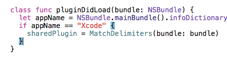

Matching Delimiters
================

An Xcode plugin to highlight matched delimiters. A hobby/side project so don't get your hopes up :)

While Xcode briefly highlights an opening delimiter when you scroll past a closing one, this plugin keeps a background color active, much like in every other editor ever.

Install
===============
You can git clone this repo and build it yourself or download the binary from the release tag and place it in `~/Library/Application Support/Developer/Shared/Xcode/Plug-ins`.

Usage
===============
Put the caret just after one of `{}` and the plugin will highlight both the opening and closing delimiter.

TODO
==============
The plugin is super naive at the moment, matching delimiters in strings and all. Could be useful, but should probably be optional.

Credits
=============
kattrali's [Xcode Plugin Template](https://github.com/kattrali/Xcode-Plugin-Template) is the best. Additional inspiration from [XVim](https://github.com/XVimProject/XVim) and [Backlight for XCode](https://github.com/limejelly/Backlight-for-XCode).